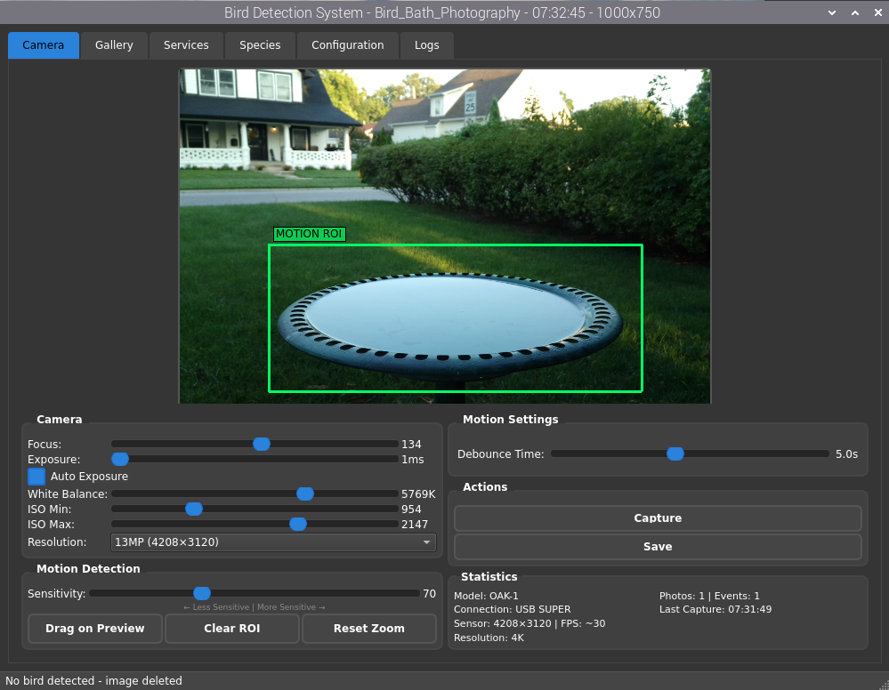
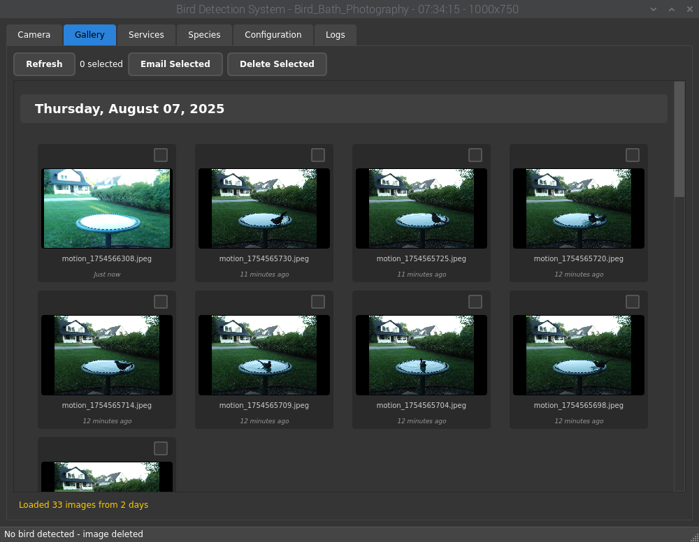
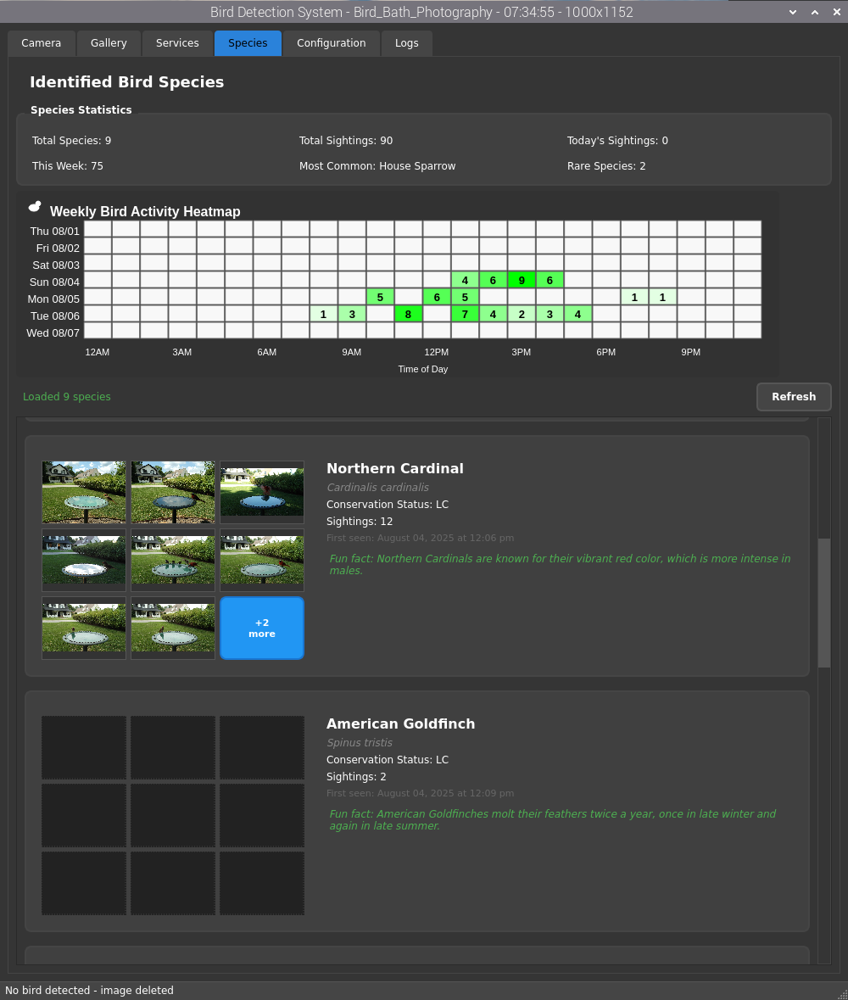

# AI Bird Photography System

Automatically photograph and identify birds (or other things) at your bird bath or feeder using AI and computer vision.



## What It Does

- AI identifies bird species using OpenAI Vision API
- Automatic photography with motion detection
- Photo gallery with day grouping and multi-select
- Species galleries with photo collections
- Mobile web interface for remote monitoring
- Google Drive backup (optional)
- Email reports with daily summaries (optional)
- Smart cleanup - deletes non-bird photos

## Quick Start

```bash
git clone https://github.com/jaysettle/Bird_Bath_Photography.git
cd Bird_Bath_Photography
./install.sh
python3 main.py
```
The Oak camera takes a minute to initialize be patient after running python3 main.py!!

The app automatically creates your config.json from the template on first run.

## Setup

1. Connect your OAK-1 camera
2. Run the app - it opens a GUI window
3. Go to Configuration tab to set up (Optional):
   - OpenAI API key (for bird identification)
   - Email settings (for reports)
   - Google Drive (for cloud backup)
4. Position camera 3-6 feet from your bird bath
5. View species on mobile at http://your-pi-ip:8080
6. If you don't enter OpenAI API, email or Google Drive keys and auth, the app will still work and save to your local directory.

## Requirements

- Raspberry Pi 5 (4GB+ RAM recommended)
- OAK-1 Camera (DepthAI compatible)
- Internet connection
- OpenAI API key - optional (for bird identification)

## OAK-1 Camera

https://shop.luxonis.com/products/oak-1?variant=42664380334303

## Bird Bath


https://www.amazon.com/dp/B07K1WY1M4?ref_=ppx_hzsearch_conn_dt_b_fed_asin_title_2

**Key Features:**
- 12 MP central RGB camera with auto-focus and fixed-focus variants
- Global shutter option with 1 MP OV9782 sensor
- 4 TOPS of processing power (1.4 TOPS for AI)
- Dimensions: 36x54.5x27.8 mm
- Weight: 53.1g
- USB2/USB3 for power delivery and communication

## Mobile Interface

Access your bird monitoring system from your network:
- Detection statistics
- System status
- Species gallery

## Contributing

This is an open-source bird conservation project. Contributions welcome.

## License

Open source - use responsibly for bird conservation and education.

## App Screenshots






